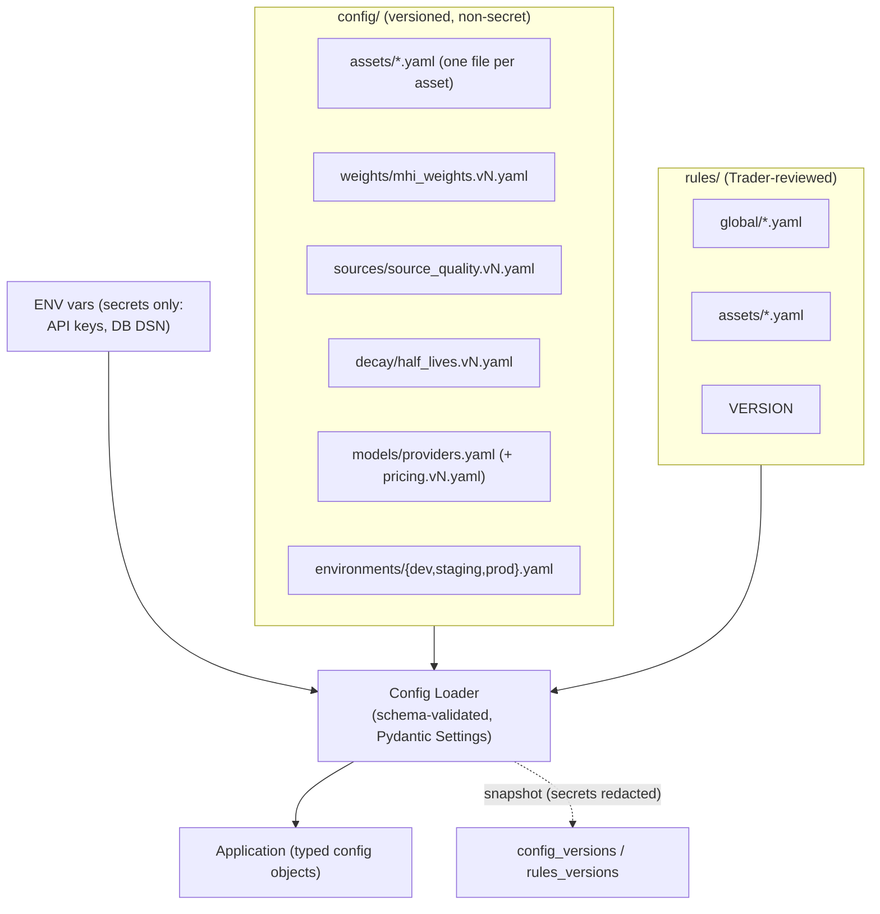

# Cross-Cutting Concerns

> **Milestone 1.** Configuration management, error-handling strategy, logging, observability, monitoring,
> security, and cost governance. **Design only — no code.** Terms binding per
> [../product/09-domain-dictionary.md](../product/09-domain-dictionary.md). Ops requirements from master-prompt
> §12; staging per challenge A1.
> **Version:** 1.0.0

---

## 1. Configuration management

**Principle:** config is **versioned data outside `src/`** (master-prompt §10); reviewed by non-engineers
(Trader reviews `rules/`, PM reviews `docs/product/`); **every run records the exact versions it used**;
**secrets only via environment variables** (12-factor).

- **Per-asset config** (`config/assets/*.yaml`): adding Silver/Nasdaq = **one new file, zero code changes**
  (F-8 principle). Fields: symbol, class, `regime_sensitivity`, decimals, trading hours, staleness threshold,
  **ATR-relative noise bands** (A5), price sources + aggregation (ADR-009), indicator set (reduced for index
  assets — A8).
- **Provider config** (`providers.yaml`) drives all provider behavior (frozen ADR-007 §3); **API keys via
  `api_key_env`, never in the file**.
- **Config validation:** every config file is schema-validated on load; a malformed config fails fast at
  startup, not mid-run.
- **Versioning:** each config/rule bundle has a SemVer; snapshots (secrets redacted) go to
  `config_versions`/`rules_versions` and the version ids into every `runs` row.
- **Environments:** `dev` (SQLite, mock ingestors, mock LLM) → `staging` (Postgres, real sources, cheap model)
  → `prod`. Non-secret env config in `config/environments/`.

**Why files over a config DB at MVP:** git review + versioning + non-engineer ownership come for free with
files; a config DB (Phase 2 dynamic rules) adds infra without MVP value. **Con:** a config change needs a
deploy — acceptable at MVP cadence.

---

## 2. Error-handling strategy (taxonomy + policy)

**Principle:** *degrade, don't crash.* Every failure class has a defined policy; the pipeline aborts only on a
persistence failure, and never corrupts the append-only log.

| Class | Example | Policy | Surfaced as |
|-------|---------|--------|-------------|
| **Data-source failure** | kifpool/crypto/news source down or stale | mark `is_stale` + `data_gaps`; continue with last-good; deviation checks | `data_gaps[]`, `is_stale`, alert if persistent |
| **Cross-source divergence** | crypto venues disagree > threshold | **flag, never average** (ADR-009) | `deviation_flags` |
| **LLM provider failure** | timeout/5xx/refusal | retry → failover to next provider (ADR-011) | Call Records (per-attempt), transparent |
| **All LLM providers fail** | full outage | **Degraded Run** (deterministic-only, honest absence) | `is_degraded=true`, `guardrail_flags`, alert |
| **Structured-output invalid** | unparseable LLM response | treat as call failure → retry/failover | as LLM failure |
| **Guardrail flag** | contradiction summary vs scores | **publish-with-flags** (default) | `guardrail_flags[]` |
| **Guardrail hard-fail** | schema-invalid output | **block publish** for that field/run per policy; alert | error + alert |
| **Persistence failure** | DB unavailable | fail the run safely (no partial write); idempotent re-trigger | 503 on API; alert |
| **Config invalid** | malformed YAML | fail fast at startup | startup error |

**Idempotency & partial-run semantics:** re-triggering a `run_id` is a no-op; a run either fully persists
(`run_inputs` + `run_outputs` + Call Records in one logical unit) or is retried — no half-written runs are
published. Degraded runs are **complete** runs (deterministic fields present), not partial runs.

**Guardrail publish-vs-block policy (explicit):** *publish-with-flags* for consistency/contradiction/grounding
issues (the user sees the flag and the data); *block* only for schema-invalid output that would break the
contract. This choice favors availability + transparency over silent suppression, matching the product's
honesty stance.

---

## 3. Logging strategy

- **Structured JSON logs** (structlog); **`run_id` on every line** (§12) plus `stage`, `component`, and (for
  LLM lines) `provider`/`model`/`call_id`.
- **No secrets, no PII** ever logged (there is no PII in the system by design — §12 security).
- **Log levels:** stage transitions at INFO; degradation/failover at WARN; block/abort at ERROR; verbose
  request/response bodies only at DEBUG and never in prod for provider payloads (those live in Call Records,
  access-controlled).
- **Correlation:** API requests carry a `correlation_id` (also in error responses) so a consumer issue can be
  traced to a run and its stages.

---

## 4. Observability & monitoring

**Exported metrics (§12):**

| Metric | Type | Purpose |
|--------|------|---------|
| run latency by stage | histogram | find slow stages; SLO tracking |
| LLM latency / tokens / cost per call | histogram/counter | cost governance + provider metrics |
| guardrail-flag rate | counter | quality signal (KPI-P12) |
| data-gap rate per source | counter | ingestion health |
| LLM-vs-rules divergence rate | counter | KPI-M8 (evaluation-adjacent, operational view) |
| provider success/timeout/failure rate | counter | provider health (operational only) |
| fallback frequency / circuit state | gauge | resilience visibility |
| API request latency / status | histogram | API SLO (p95 ≤ 300 ms) |
| monthly LLM spend vs budget | gauge | cost alert at 80% |

**Alerts (§12):** missed run (no run within 6h+15min), LLM fallback engaged (Degraded Run), guardrail block,
source-deviation flag, budget threshold (80%).

**Hard wall (frozen):** provider **operational** metrics never feed market scores/regime/rules/evaluation
model-quality metrics (ADR-007 D-7). Operational dashboards and model-quality reports are separate surfaces
(KPI tree keeps the two families distinct).

**Staging (A1):** metrics/dashboards land in **Milestone 5/6**; the metric *names and emission points* are
fixed now so instrumentation isn't retrofitted.

---

## 5. Security architecture

- **Static API key** on external endpoints; **read vs write** key scopes (write = event ingestion + manual
  trigger). Full auth is a non-goal (§3).
- **Secrets via ENV only** — API keys (providers + kifpool), DB DSN. Never in repo, config, or logs.
- **Upstream keys are read-only, market-data scope** (including kifpool).
- **No PII anywhere** — market data only.
- **`pip-audit` in CI**; dependency and image scanning.
- **Rate limiting** on the public API (staged to M5).
- **Non-root container**, minimal image (deployment.md).
- **Input validation** at every boundary (Pydantic) — the `POST /v1/events` write path is strictly validated
  (surprise is computed server-side from consensus/actual, never trusted from the client).

---

## 6. Cost governance

- **Automatic per-call cost** = tokens × versioned `pricing.vN.yaml`, stored in `call_records.estimated_cost`
  (frozen ADR-007 D-6) — **no manual accounting**.
- **Monthly budget** in config; **alert at 80%** (§12). Monthly report includes cost-per-run trend and the
  cost side of the pre-registered synthesis decision rule (value vs cost).
- **Self-consistency off by default** (A3) keeps the largest recurring cost contained.
- Cost is an **operational** metric — it informs routing/budget, never market outputs.

---

## 7. Traceability of cross-cutting decisions to Milestone 0

| Concern | Milestone 0 anchor |
|---------|--------------------|
| Config-as-data, versioned | §10 folder structure; release policy versioning |
| Degrade-don't-crash | ADR-011; PRD F-9; UC-4/UC-7 |
| Honest weights/confidence; no PII; observation-only | §7; compliance; KPI tree |
| Cost governance | §12; KPI-P13/P14 |
| Security posture | §12; compliance §5 |
| Metrics families kept separate | KPI tree §0 (product vs model quality) |
