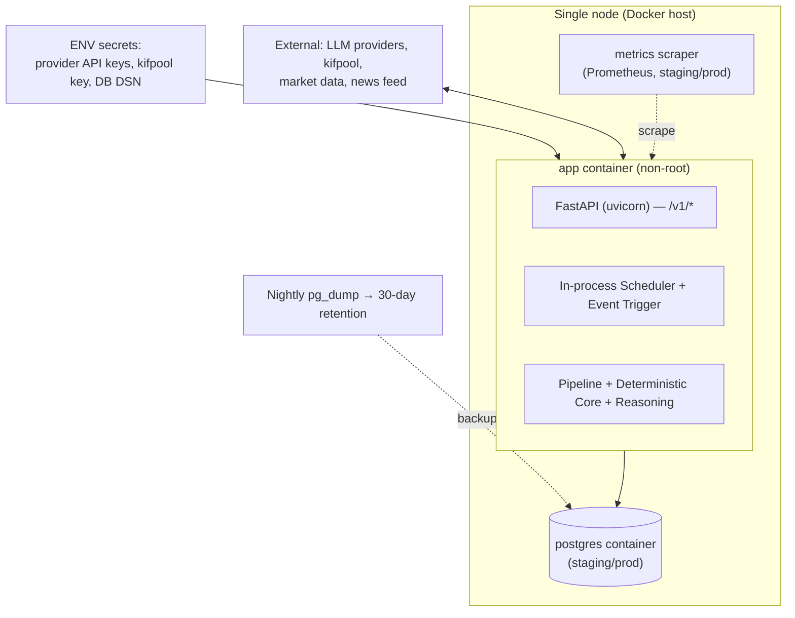
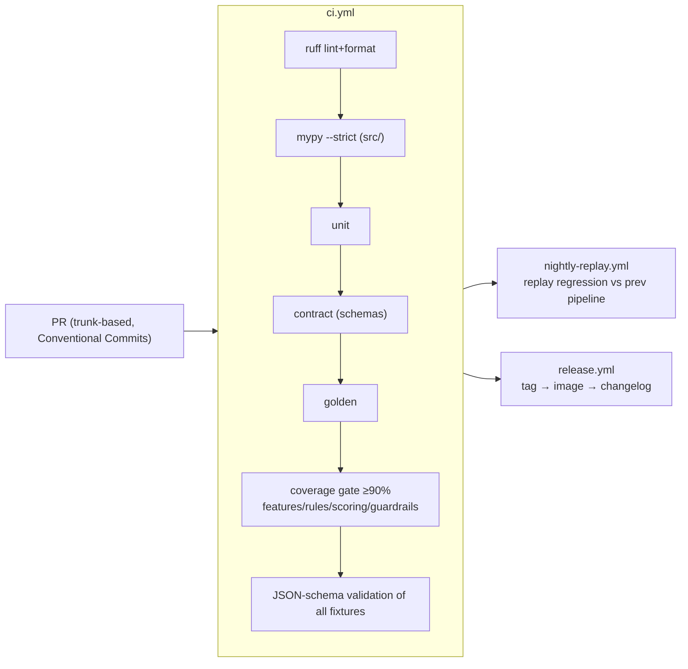
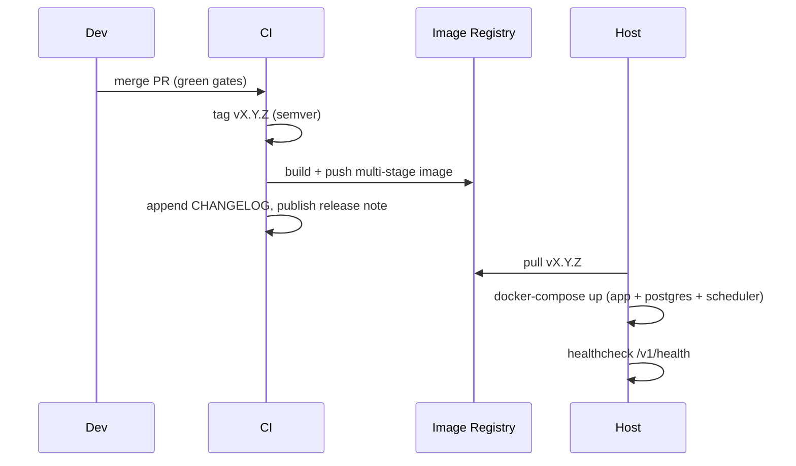

# Deployment Architecture & Folder Structure

> **Milestone 1.** Docker architecture, deployment topology, environments, and the canonical folder structure.
> **Design only — no Dockerfile, no compose file, no code.** Single-node is acceptable for MVP (master-prompt
> §3); the compose file is the deployment contract (§12). Staging of heavy ops per challenge A1
> ([ADR-010](../adr/ADR-010-environments-secrets-deployment.md)). **API-only, no front-end** (ADR-012).
> **Version:** 1.0.0

---

## 1. Deployment topology (single-node MVP)



- **`app` container** runs API + Scheduler + Pipeline **in one process** (single-node MVP; APScheduler
  in-process). **Rationale:** ~4 runs/day; no broker needed (A1). **Con:** app restart pauses scheduling —
  covered by missed-run detection + idempotent re-trigger.
- **`postgres` container** in staging/prod; **dev uses SQLite** in-container (no DB service).
- **`metrics` scraper** (Prometheus) in staging/prod only.
- **The `docker-compose.yml` is the deployment contract** (app + postgres + scheduler), per §12.

**Alternative rejected:** separate scheduler/worker containers + broker (Celery/Redis) — over-engineered for
MVP volume; revisit only if run volume or horizontal scaling is needed (explicitly a non-goal, §3).

## 2. Docker architecture

- **Multi-stage build:** builder stage (deps, compile) → slim runtime stage; **non-root user**; minimal base
  image; no dev tooling in the runtime image.
- **12-factor:** config via files + **secrets via ENV**; logs to stdout (JSON); no secrets baked into layers.
- **Healthcheck:** container healthcheck hits `/v1/health`.
- **Image provenance:** built in CI (`release.yml`), tagged by SemVer git tag; `pip-audit` + image scan gate.

## 3. Environments (§12, ADR-010)

| Env | DB | Ingestors | LLM | Purpose |
|-----|----|-----------|-----|---------|
| **dev** | SQLite | mock ingestors | mock/deterministic provider | local + hermetic CI; no internet |
| **staging** | Postgres | real sources | real provider, **cheap model** | pre-prod validation on real data |
| **prod** | Postgres | real sources | configured provider(s) | production |

Per-environment non-secret config in `config/environments/`; secrets always via ENV.

## 4. CI/CD (live from Milestone 3, §12)



- **LLM calls always mocked** in CI (recorded fixtures / provider doubles) — no internet (frozen invariant #10).
- **Nightly replay regression:** any diff vs the previous pipeline version on identical inputs **fails the
  build** unless a changelog/ADR entry explains it (§12).
- **Coverage gate ≥ 90%** on `features/`, `rules/`, `scoring/`, `guardrails/` (§12).

## 5. Reliability, backup, DR (staged per A1)

- **SLOs (§12):** scheduled run ≤ 10 min after tick; event run ≤ 5 min; API p95 ≤ 300 ms; availability 99.5%.
- **Missed-run detection:** no run persisted within 6h+15min → alert.
- **Backups:** nightly `pg_dump`, 30-day retention, RPO 24h / RTO 4h; **event log tables included** (losing
  them destroys replay). Restore rehearsed once before M7 sign-off.
- **Idempotency:** re-triggering an existing `run_id` is a no-op.

## 6. Canonical folder structure (master-prompt §10 — binding; deviations require an ADR)

> Rationale (§10): config/rules/prompts/schemas live **outside** `src/` because they are versioned data
> reviewed by non-engineers; `src/` contains only code. **No front-end directory exists** (ADR-012).

```
market-state-engine/
├── README.md · CHANGELOG.md · CONTRIBUTING.md · Makefile · pyproject.toml · .env.example
├── .github/workflows/       ci.yml · nightly-replay.yml · release.yml
├── docker/                  Dockerfile · docker-compose.yml
├── docs/
│   ├── bible/PROJECT_BIBLE.md          (GENERATED, M7)
│   ├── product/                        (Milestone 0 — done)
│   ├── architecture/                   (Milestone 1 — this set)
│   │   ├── overview.md · module-catalog.md · database.md · api-design.md
│   │   ├── pipelines.md · llm-provider-architecture.md · llm-architecture-m1.md
│   │   ├── cross-cutting.md · deployment.md · sequence-diagrams.md
│   │   ├── evolution-roadmap.md · error-handling.md*  (*folded into cross-cutting.md)
│   │   └── diagrams/                   (*.mermaid sources, extracted in M2 if needed)
│   ├── adr/                            ADR-001 … ADR-013
│   ├── api/openapi.yaml                (Milestone 2)
│   ├── evaluation/                     (specs, decision-rule templates, monthly reports)
│   └── runbook/                        operations.md · incident-playbooks.md · model-migration.md (M7)
├── schemas/                 market_state_run.v1.0.0.json + internal/*.json   (Milestone 2)
├── config/                  assets/ · weights/ · sources/ · decay/ · models/ · environments/
├── rules/                   global/ · assets/ · VERSION
├── prompts/                 sentiment/vN.md · synthesis/vN.md               (Milestone 4)
├── src/market_state_engine/
│   ├── core/ · ingestion/ · features/ · rules/ · news/ · scoring/
│   ├── reasoning/           (MarketReasoner, adapters/, prompt_builder, gateway)
│   ├── guardrails/ · pipeline/ · persistence/ · evaluation/ · api/ · observability/
├── tests/                   unit/ · contract/ · golden/ · replay/ · fixtures/
└── scripts/                 run_once.py · replay.py · generate_bible.py · monthly_report.py
```

**Deviations from §10 in this milestone (each justified):**
- `docs/architecture/error-handling.md` content is **folded into `cross-cutting.md`** (error taxonomy lives
  with the other cross-cutting concerns) — a documentation-organization choice, not an architecture change.
  If you prefer a standalone `error-handling.md`, it can be split out; noted as a minor open item.
- Added `llm-provider-architecture.md` (frozen) and `llm-architecture-m1.md` beyond the §10 list — additive,
  to carry the frozen provider spec the user mandated.
- **No `frontend/` and no UI assets** — consistent with §3 and ADR-012.

## 7. Deployment sequence (release)


