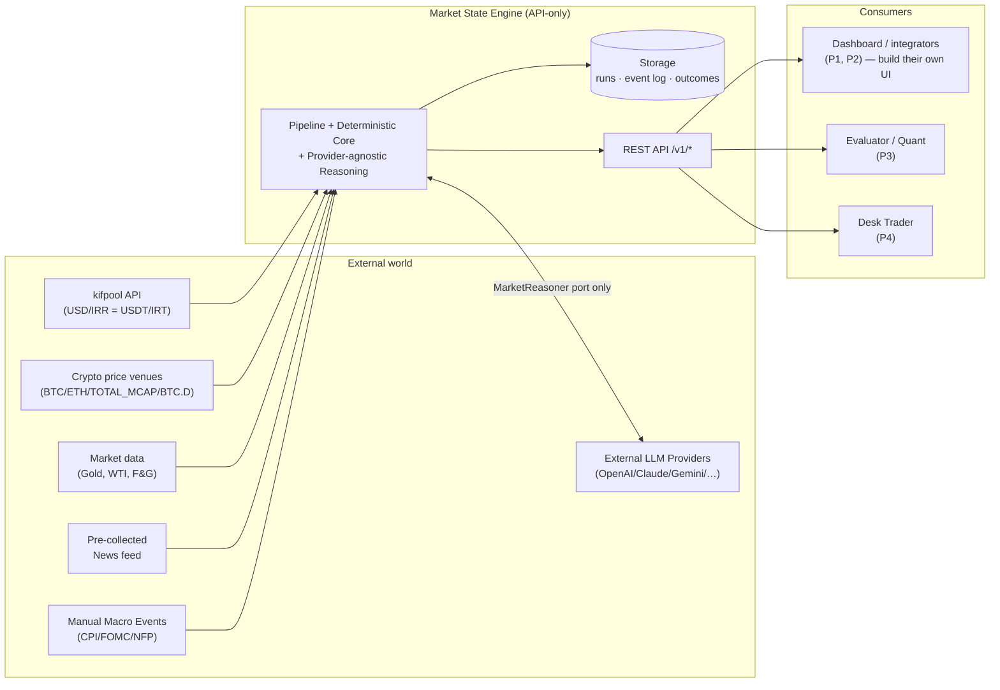
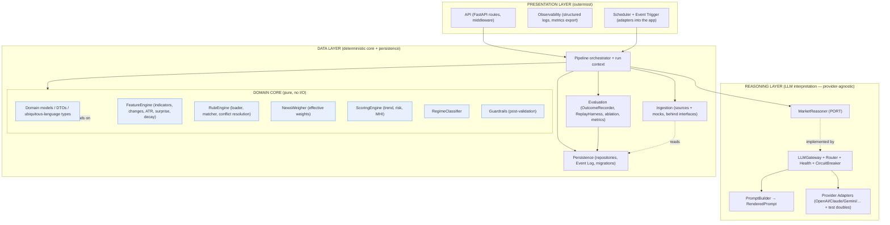
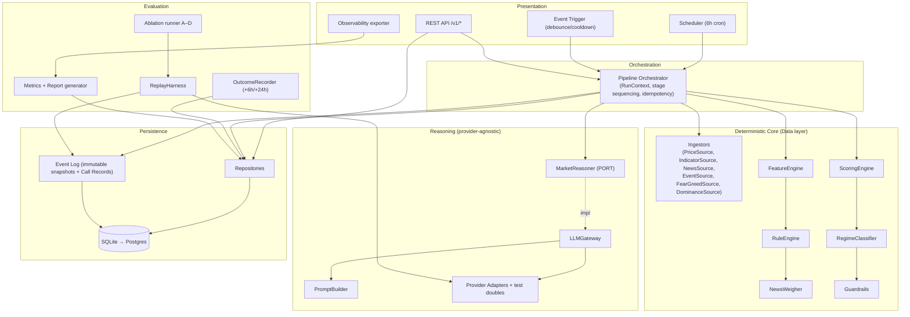

# Architecture Overview — Market State Engine

> **Milestone 1 — Architecture Foundation.** Production-ready architecture specification. **No application
> code** — design, engineering decisions, diagrams, and documentation only.
> **Consistency:** every decision here conforms to the Milestone 0 product set and the frozen
> [LLM Provider Architecture](llm-provider-architecture.md) (ADR-007, ADR-011). Terms are binding per
> [../product/09-domain-dictionary.md](../product/09-domain-dictionary.md).
> **Version:** 1.0.0

## Reading order (Milestone 1 documents)

| # | Document | Covers (from the M1 request) |
|---|----------|------------------------------|
| 1 | **overview.md** (this) | High-level architecture, layered/clean architecture, dependency rules, component diagram, technology stack |
| 2 | [module-catalog.md](module-catalog.md) | Component responsibilities, inputs/outputs, owner boundaries, dependency rules |
| 3 | [database.md](database.md) | Database architecture, ER diagram, all tables, SQLite→Postgres path |
| 4 | [api-design.md](api-design.md) | API-first design, endpoint catalog, envelope, versioning, auth, error contract |
| 5 | [pipelines.md](pipelines.md) | Scheduler, Market State generation, News ingestion, Rule Engine, Replay, Evaluation, Event Log |
| 6 | [llm-provider-architecture.md](llm-provider-architecture.md) | **FROZEN** provider-agnostic LLM architecture (ADR-007/011) |
| 7 | [cross-cutting.md](cross-cutting.md) | Config management, error handling, logging, observability, monitoring, security, cost governance |
| 8 | [deployment.md](deployment.md) | Docker architecture, deployment topology, environments, folder structure |
| 9 | [sequence-diagrams.md](sequence-diagrams.md) | Scheduled/event/degraded/replay/outcome/news sequences |
| 10 | [evolution-roadmap.md](evolution-roadmap.md) | Phases 1–7, extension points, feature→component traceability, implementation plan |
| — | [../adr/](../adr/) | ADR log (ADR-001…013) |

---

## 1. System context (what this system is and is not)

The Market State Engine produces a **Market State** — a structured, explainable, auditable snapshot of market
conditions — every 6 hours and immediately after major macro events, across six assets plus a Global Regime
(see [../product/01-vision.md](../product/01-vision.md)). It is **API-only**: it owns a JSON contract and a
REST API. **It has no front-end** (master-prompt §3; [ADR-012](../adr/ADR-012-api-only-no-frontend.md)).

**Why this boundary:** the product's value is trust through traceability. Keeping the system API-only (a) makes
the JSON contract the single source of truth for every consumer, (b) keeps the deterministic core and the
provider abstraction as the only things we build, and (c) matches the non-goal "No UI implementation" (§3).
**Alternative rejected:** bundling a reference UI — rejected because it dilutes focus, creates a second
contract (the UI's expectations) that can drift from the JSON schema, and violates §3.

---

## 2. Layered / Clean Architecture

The system is **strictly layered** into three layers (master-prompt §5) and follows **Clean Architecture**
dependency direction: **dependencies point inward; the domain core depends on nothing external.**

### The dependency rule (frozen, CI-enforced from M3)

1. **Domain Core depends on nothing** outside itself — no I/O, no framework, no vendor SDK, no LLM. Pure
   functions over domain types. (`features/`, `rules/`, `news/`, `scoring/`, `guardrails/`, `core/`.)
2. **The Core references the External LLM only through `MarketReasoner`** — the single port. No vendor SDK is
   importable outside `reasoning/adapters/` (frozen invariant #1, [llm-provider-architecture.md §12](llm-provider-architecture.md)).
3. **Presentation depends on the application, never the reverse.** The API, Scheduler, and Observability are
   adapters *into* the pipeline; the pipeline knows nothing about HTTP or cron.
4. **Persistence is behind repository interfaces.** The Domain Core never imports SQLAlchemy/SQLite/Postgres;
   it depends on repository ports fulfilled by the persistence layer.
5. **Ingestion is behind source interfaces.** Adding a data source = one new ingestor implementing the port
   (mirrors the provider rule). USD/IRR (kifpool) is one such ingestor behind `PriceSource`.

**Why Clean Architecture here:** the two hardest requirements — **lossless replay** and **provider
independence** — both demand that the deterministic core be an island with no hidden dependencies. If scoring
could reach the network or a vendor SDK, replay would be non-reproducible and provider-swapping would leak into
business logic. Clean Architecture makes those violations *structural* (a forbidden import), not merely a
convention. **Alternatives rejected:** (a) a conventional service/DAO layering without an enforced dependency
rule — rejected because nothing prevents a scoring module from importing the DB or an SDK, and the replay/
provider guarantees would erode; (b) hexagonal-only without the three named layers — rejected because the
master prompt mandates the Data/Reasoning/Presentation layering explicitly, and it maps cleanly onto ports &
adapters anyway.

---

## 3. High-level component diagram

Full per-component responsibilities, inputs, outputs, and owner boundaries are in
[module-catalog.md](module-catalog.md).

---

## 4. Technology stack (with rationale, trade-offs, alternatives)

> Choices favor **determinism, replayability, testability, and provider independence** over novelty
> (master-prompt §7 "no over-engineering"). Every choice is an ADR candidate or already covered by a seed ADR.

| Concern | Choice | Why | Trade-offs / cons | Alternatives rejected |
|---------|--------|-----|-------------------|-----------------------|
| **Language** | **Python 3.12+** | Master prompt mandates `pyproject.toml`, `ruff`, `mypy --strict`, `pytest`; richest ecosystem for data + LLM SDKs; team-standard. | GIL (irrelevant — I/O-bound, low concurrency); runtime typing needs discipline (mitigated by `mypy --strict`). | Go/Rust (faster, but poorer LLM/data ecosystem and slower iteration for a doc-heavy, I/O-bound MVP); TypeScript/Node (weaker numeric/scientific libraries for indicators & metrics). |
| **API framework** | **FastAPI** | Async, first-class Pydantic v2 validation (schema enforcement is a core requirement), automatic OpenAPI generation (our API contract is a deliverable), low p95 latency for simple reads. | Ties us to Starlette/uvicorn; async correctness discipline. | Flask (no native async, manual OpenAPI, weaker validation); Django (too heavy — ORM/admin/auth we don't need per §3). |
| **Data validation / DTOs** | **Pydantic v2** | Enforces JSON Schemas at the boundary; DTOs (`ReasoningRequest/Response`, `NewsDigest`, `RuleActivation`) are validated models; fast (Rust core). | Version pinning; some learning curve. | dataclasses + manual validation (reinvents validation, error-prone for a contract-first system); attrs (no built-in JSON Schema). |
| **Persistence / ORM** | **SQLAlchemy 2.x (Core + typed ORM)** | Single codebase for **SQLite (dev) → Postgres (staging/prod)** ([ADR-006](../adr/ADR-006-storage-choice.md)); explicit, testable, migration-friendly. | ORM overhead; must avoid dialect-specific SQL to keep the SQLite↔Postgres path clean. | Raw SQL (portability + typing burden); Django ORM (framework lock-in); an async ORM (unneeded at MVP write volume — ~4 runs/day). |
| **DB — dev** | **SQLite** | Zero-ops local + CI; file-based; perfect for mock-ingestor/mock-LLM dev and hermetic tests. | Limited concurrency; not for prod. | Postgres everywhere (heavier local/CI; violates "simpler when equal" for dev — challenge A1). |
| **DB — staging/prod** | **PostgreSQL 16** | ACID, JSONB for immutable input snapshots + Call Records, robust backups (§12 DR), scales past MVP. | Ops burden (staged per A1 to M5/M7). | MySQL (weaker JSON/immutability ergonomics); a document store (loses relational integrity for runs/outcomes/versions joins). |
| **Migrations** | **Alembic** | Standard with SQLAlchemy; versioned schema evolution matches our versioning discipline. | Another artifact to review. | Hand-written SQL migrations (error-prone, no autogen diff). |
| **Scheduler** | **In-process APScheduler** (single-node) | Matches "single-node acceptable for MVP" (§3); cron (6h) + one-off event debounce in one process; no external broker. | Single point of failure (acceptable at MVP; missed-run detection alerts per §12). | Celery/RQ + Redis broker (over-engineered for ~4 runs/day — challenge A1); system cron calling a CLI (loses in-process idempotency/debounce state). |
| **LLM access** | **Provider adapters behind `LLMGateway`** ([ADR-007](../adr/ADR-007-provider-agnostic-llm-gateway.md)) | Provider independence is a frozen hard requirement; no vendor SDK in the core. | Abstraction cost (accepted — see ADR-007). | Direct vendor SDK (rejected: leaks vendor into core, breaks replay); a SaaS router as the boundary (rejected as the boundary; allowed *behind* an adapter). |
| **HTTP client (ingestion + adapters)** | **httpx** | Async + sync, timeouts, retries, testable transport (crucial for offline tests). | One more dep. | requests (no async; weaker test transport); aiohttp (lower-level ergonomics). |
| **Config** | **YAML files + Pydantic Settings; secrets via ENV only** | 12-factor (§12); config is versioned data reviewed by non-engineers (Trader reviews `rules/`); every run records versions used. | YAML foot-guns (mitigated by schema-validated config loaders). | TOML (less friendly for nested rule/provider config); env-only (can't express rich per-asset/provider structures); DB-stored config (loses git review/versioning at MVP — Phase 2). |
| **Logging** | **structlog (JSON structured logs)** | `run_id` on every line (§12 observability); machine-parseable; correlation across stages. | Slightly more setup than stdlib logging. | stdlib logging only (unstructured; hard to correlate); print (non-starter). |
| **Metrics** | **Prometheus client (pull) + OpenMetrics** | Standard, scrape-based, pairs with any dashboard; matches §12 exported-metrics list. | Needs a scraper in prod (compose service). | StatsD/push (extra infra); logs-as-metrics (fragile). |
| **Testing** | **pytest + pytest-asyncio + schemathesis (contract) + hypothesis (property, for guardrails)** | Master prompt mandates unit/contract/golden/replay/property tests; hermetic (no internet) via provider doubles + mock ingestors. | Test-suite maintenance. | unittest (less ergonomic); no property tests (weaker guardrail coverage — § testing). |
| **Lint/format/type** | **ruff + mypy --strict** | Mandated by §12 CI gates; fast, single-tool lint+format. | `--strict` friction (intended — catches contract drift). | black+flake8+isort (slower, 3 tools vs 1); no strict typing (rejected — typing is a stated principle). |
| **Containerization** | **Docker multi-stage, non-root; docker-compose (app + postgres + scheduler)** | §12 deployment contract; single-node acceptable. | Compose is not orchestration (fine at MVP). | Kubernetes (over-engineered for single-node MVP — §3); bare-metal (no reproducible deploy). |
| **CI** | **GitHub Actions** (`ci.yml`, `nightly-replay.yml`, `release.yml`) | Matches the canonical `.github/workflows/` in §10. | Vendor-specific CI YAML. | GitLab CI/Jenkins (not the mandated structure). |

**Cross-cutting rationale:** every technology is chosen so that (1) the deterministic core stays pure and
replayable, (2) provider independence is structurally enforced, and (3) the MVP stays single-node and simple
(A1) while leaving the Postgres/observability/DR path open for M5–M7.

---

## 5. Key architectural principles (traceable to Milestone 0 & the freeze)

| Principle | Enforced by | Source |
|-----------|-------------|--------|
| Deterministic by default | Domain Core purity; LLM only via `MarketReasoner`; import-boundary lint | §7, ADR-001 |
| Provider independence | `MarketReasoner` port + `LLMGateway` + adapters; providers are config | **Frozen** ADR-007 |
| Never abort on provider failure | Failover chain → Degraded Run | **Frozen** ADR-011 |
| Everything replayable | Immutable input snapshots + Call Records in Event Log | ADR-004 |
| Honest weights & confidence | `computed` vs `ordinal`; deterministic confidence | §7, challenge A2 |
| Config-as-data, versioned | YAML config/rules/prompts outside `src/`; versions recorded per run | §10 |
| API-only, no front-end | No UI code; JSON contract + REST is the product surface | §3, ADR-012 |
| Market realism | Trader-reviewed rules; ATR-relative noise thresholds | §7, challenges A4/A5 |

---

## 6. What Milestone 1 does **not** decide (deferred, by design)

- **Concrete JSON Schemas & DTO field lists** → Milestone 2 (contracts). This doc fixes *shapes and
  responsibilities*, not final field names.
- **Actual rule contents / thresholds** → authored with Trader sign-off in M3+.
- **Prompt template text** → Milestone 4.
- **Any code** → M3 onward.

Open questions that would change the architecture are collected at the end of
[evolution-roadmap.md](evolution-roadmap.md#open-questions) — none are guessed.
