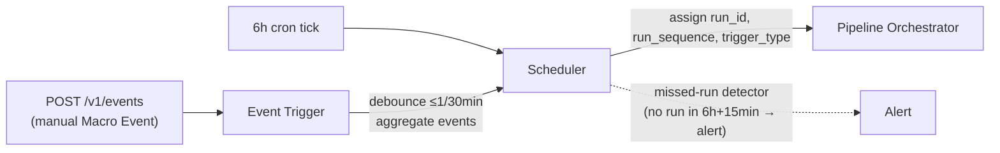
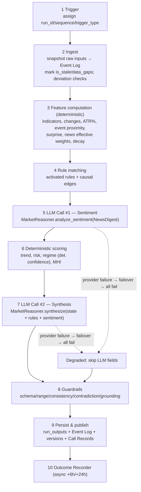
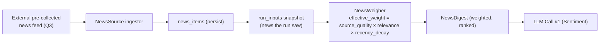
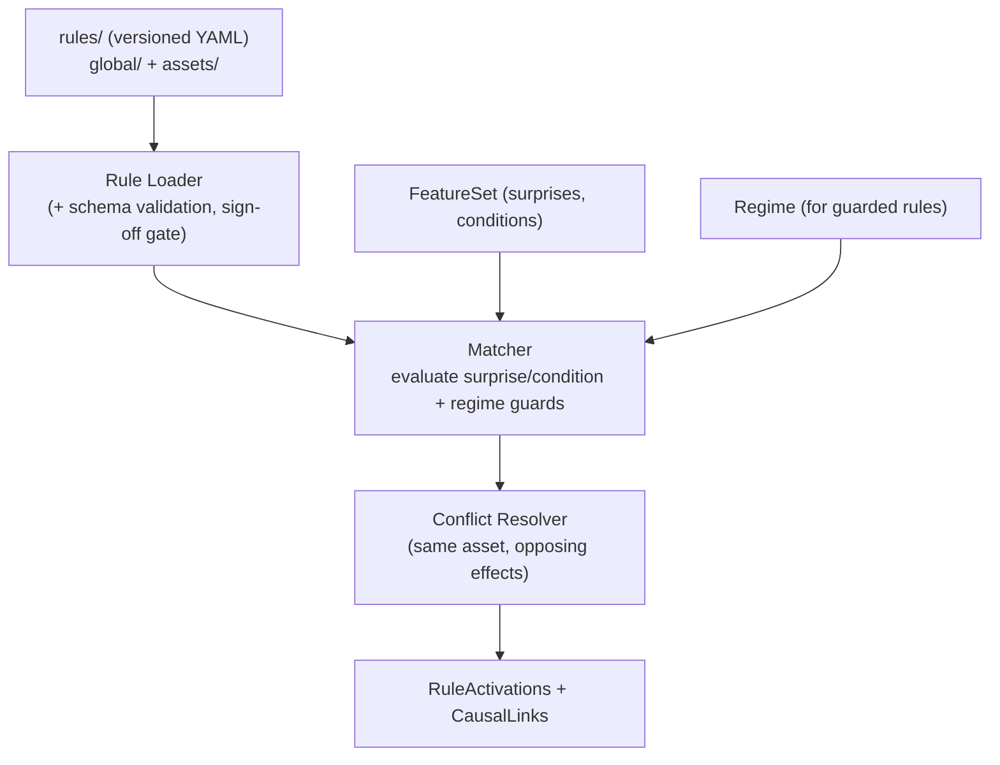
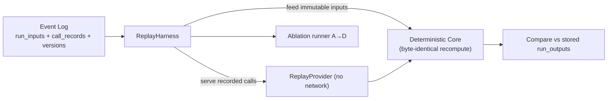
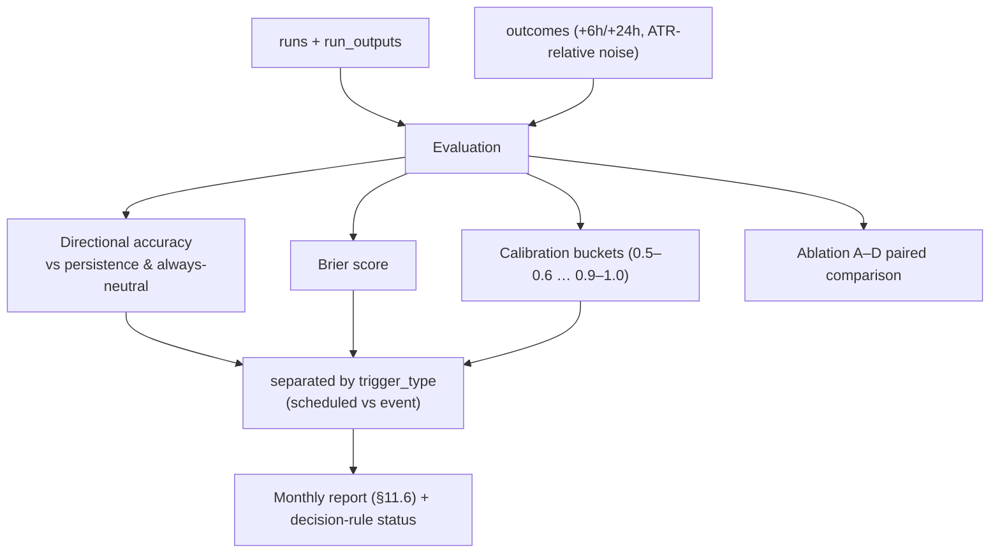
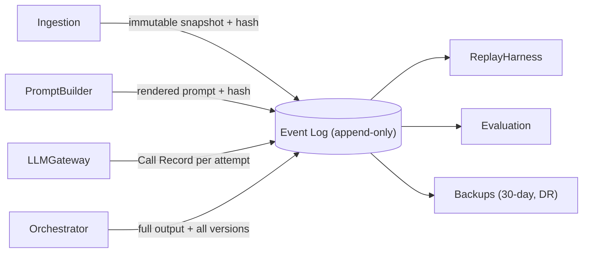

# Pipeline Architectures

> **Milestone 1.** The runtime pipelines: Scheduler, Market State generation, News ingestion, Rule Engine,
> Replay, Evaluation, and the Event Log. **Design only — no code.** Sequence diagrams in
> [sequence-diagrams.md](sequence-diagrams.md). Terms binding per
> [../product/09-domain-dictionary.md](../product/09-domain-dictionary.md).
> **Version:** 1.0.0

---

## 1. Scheduler & Event Trigger architecture

- **Two trigger paths:** scheduled (6h cron) and event (macro release). Both converge on one Orchestrator so
  the lifecycle is identical regardless of trigger.
- **Debounce/cooldown:** max **one event run per 30 minutes**; events arriving within the window **aggregate**
  into the next event run (`trigger_detail.debounced_events`). **Why:** prevents event storms (multiple
  releases in minutes) from producing redundant runs; a desk needs one consolidated read, not five.
- **Idempotency:** re-triggering an existing `run_id` is a **no-op** (§12). The Scheduler assigns identity; the
  Orchestrator enforces the no-op.
- **Single-node, in-process** (APScheduler) per challenge A1; missed-run detection covers the single-point-of-
  failure risk with an alert. **Alternative rejected:** distributed scheduler/broker — over-engineered for
  ~4 runs/day.

---

## 2. Market State generation pipeline (the core lifecycle)

Implements master-prompt §4 precisely. Ten stages; the LLM appears at exactly two, both via `MarketReasoner`.

**Stage notes (design decisions):**
- **Stage 2 Ingest:** each source is behind an interface; **stale/missing → `is_stale`/`data_gaps`, never a
  failed run** (§4.2). Cross-source deviation checks flag (never average) divergent crypto prices (ADR-009).
  USD/IRR via kifpool (IRT, stale-fallback).
- **Stage 3 Features:** *all* arithmetic; deterministic and replay-safe (the LLM never computes numbers).
- **Stage 4 Rule matching:** surprise-based conditions; regime-guarded rules read regime **only after** stage
  6 for guards that need it — see ordering note below.
- **Stages 5 & 7 (LLM):** separated calls (ADR-002); each goes through `MarketReasoner` → `LLMGateway`; each
  can independently degrade (ADR-011 DR-5).
- **Stage 6 Scoring/Regime:** regime computed **first** among market outputs; USD/IRR excepted (ADR-005);
  `confidence` deterministic (A2).
- **Stage 8 Guardrails:** deterministic post-validation; **publish-with-flags** default; grounding check
  enforces "only numbers present in the request."
- **Stage 9 Persist:** immutable `run_inputs`/`run_outputs` + Call Records + all versions.
- **Stage 10 Outcome:** async, at horizon maturity.

> **Ordering subtlety (documented, not guessed):** Stage 4 rule matching generally precedes scoring, but
> **regime-guarded** rules (challenge A4, e.g., gold-CPI) need the regime, which is computed in Stage 6. The
> design resolves this with a **two-phase rule evaluation**: (4a) match all non-regime-guarded rules pre-
> scoring; (6b) after regime is known, evaluate regime-guarded rules and merge activations before synthesis.
> This keeps regime-first flow (ADR-005) intact without a circular dependency. Flagged in Open Questions for
> confirmation of the exact split.

---

## 3. News ingestion pipeline

- **Consumes, never collects** (Q3). The system reads a supplied feed into `NewsItem`s; collection is out of
  scope.
- **Weights computed in code** (F-6); the LLM consumes the digest and never assigns weights.
- **Per-event-type half-lives** drive recency decay (`config/decay/`).
- **Snapshotted** into `run_inputs` so replay feeds the exact same news the run saw.

---

## 4. Rule Engine architecture

- **YAML rulebook** (ADR-003) — dozens, not thousands; migrate to SQL only past ~50 rules. `global/` (regime +
  cross-asset) and `assets/` (incl. `usd_irr` domestic drivers).
- **Hard gate (ADR-008):** the Loader **rejects** any rule missing `economic_rationale` or
  `reviewed_by: senior_trader`. Cannot ship an unreviewed rule.
- **Surprise-based triggers** (not raw actuals); regime-guarded effects supported (A4).
- **Conflict resolution (deterministic):** when two activated rules assign opposing effects to the same asset,
  resolve by a documented, deterministic policy (e.g., higher `strength` wins; equal strength → net/attenuate;
  ties recorded as a guardrail note). **Exact policy is Open Question OQ-3** — not guessed here.
- **Only activated rules** enter prompts (F-5); the causal graph is assembled **only** from these edges (§3).
- **Testing:** rule unit tests (matcher truth tables), golden fixtures for activation, schema validation of
  every rule (contract tests).

---

## 5. Replay architecture

- **Lossless & offline:** replay re-feeds `run_inputs` to the deterministic core and serves `call_records`
  through `ReplayProvider` — **no live network, no live provider** (frozen invariant #6/#10).
- **Byte-identical** for deterministic fields (nightly replay regression fails the build on any diff unless a
  changelog/ADR explains it — §12).
- **Ablation variants:** A (rules-only) → B (+deterministic-news) → C (+LLM-sentiment) → D (full), runnable on
  identical history for paired comparison (F-9). Degraded runs naturally correspond to A/B territory.
- **Long-lived:** because the exact prompt + response are stored, replay reproduces a run years later even if
  the vendor model is gone (frozen replay requirement).

---

## 6. Evaluation architecture

- **Two baselines always shown:** persistence + always-neutral (F-10); accuracy is meaningless without them.
- **Separated by `trigger_type`** — scheduled and event runs never share a bucket.
- **Pre-registered decision rule:** e.g., "if variant D doesn't beat B by X Brier in 3 months, remove the
  synthesis role." Status tracked in every report.
- **Hard wall:** provider **operational** metrics (latency/cost/availability) never enter model-quality metrics
  (§7, ADR-007 D-7).

---

## 7. Event Log architecture

- **Append-only, immutable, in every backup** — the product's replay backbone (§12). Losing it destroys
  replayability, which destroys the product.
- Stores: immutable input snapshots, rendered prompts + hashes, **Call Records** (provider/model/hashes/tokens/
  cost/latency/finish_reason/outcome), full outputs, and every version.
- Physically realized across `run_inputs`, `run_outputs`, `call_records` (+ `rules_versions`/`config_versions`)
  — see [database.md](database.md).

---

## 8. Error & degradation behavior across pipelines (summary; full taxonomy in cross-cutting.md)

| Failure | Pipeline behavior | Result |
|---------|-------------------|--------|
| One data source stale/missing | mark `is_stale`/`data_gaps`; continue | Run publishes; gap declared |
| Cross-source price divergence > threshold | flag (never average) | `deviation_flags`; Run publishes |
| One LLM provider fails | Gateway failover to next provider | transparent; Call Records show attempts |
| **All** LLM providers fail | **Degraded Run** (rules-only, honest absence) | Run publishes, `is_degraded=true`, alert |
| Guardrail flag | publish-with-flags (or block per taxonomy) | `guardrail_flags[]` |
| DB unavailable | run fails safely; alert; ret/idempotent re-trigger | no partial/corrupt persist |

The invariant across all of these: **an external dependency never aborts the pipeline**; only a persistence
failure can, and it does so without corrupting the append-only log.
