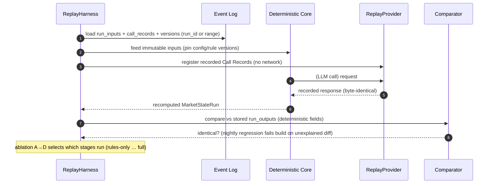
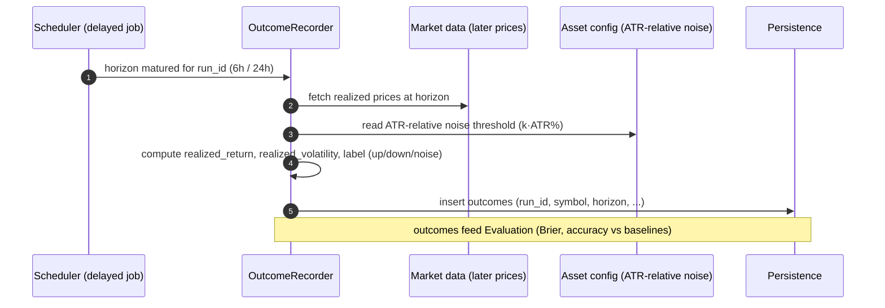
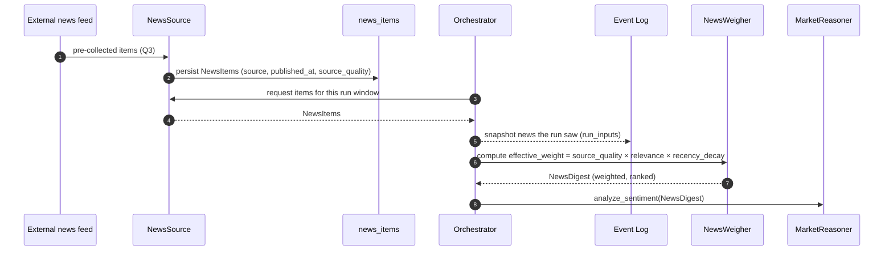

# Sequence Diagrams

> **Milestone 1.** The runtime sequences for every lifecycle: scheduled run, event run, degraded run, replay
> run, outcome recording, and news ingestion. Mermaid source (renders in GitHub/most viewers). **Design only.**
> Terms binding per [../product/09-domain-dictionary.md](../product/09-domain-dictionary.md). Component roles:
> [module-catalog.md](module-catalog.md); stage detail: [pipelines.md](pipelines.md).
> **Version:** 1.0.0

---

## 1. Scheduled run (6h cron) — the happy path

```mermaid
sequenceDiagram
  autonumber
  participant CRON as Cron (6h)
  participant SCH as Scheduler
  participant ORC as Orchestrator
  participant ING as Ingestors
  participant EL as Event Log
  participant FE as FeatureEngine
  participant RE as RuleEngine
  participant NW as NewsWeigher
  participant MR as MarketReasoner (port)
  participant GW as LLMGateway
  participant SC as ScoringEngine/Regime
  participant GR as Guardrails
  participant DB as Persistence

  CRON->>SCH: tick
  SCH->>ORC: start run (run_id, run_sequence, trigger_type=scheduled)
  ORC->>ING: ingest all sources
  ING-->>EL: immutable raw snapshots (+hash, is_stale, deviation_flags)
  ORC->>FE: compute features (indicators, changes, ATR%, surprise, decay)
  ORC->>RE: match rules (surprise-based; non-guarded)
  RE-->>ORC: activations + causal edges (phase 1)
  ORC->>NW: build NewsDigest (effective weights)
  ORC->>MR: analyze_sentiment(NewsDigest)
  MR->>GW: (impl) route → adapter → vendor
  GW-->>EL: Call Record (provider, model, hashes, tokens, cost, latency)
  GW-->>MR: sentiment scores
  MR-->>ORC: ReasoningResponse (sentiment)
  ORC->>SC: trend, risk, regime (det. confidence), MHI
  SC-->>ORC: State Vector
  ORC->>RE: evaluate regime-guarded rules (phase 2), merge
  ORC->>MR: synthesize(state + rules + sentiment)
  MR->>GW: route → adapter → vendor
  GW-->>EL: Call Record
  GW-->>MR: summaries, ordinal drivers, novelty, data-gaps
  MR-->>ORC: ReasoningResponse (synthesis)
  ORC->>GR: post-validate (schema/range/consistency/contradiction/grounding)
  GR-->>ORC: guardrail_flags[] + publish decision
  ORC->>DB: persist run_inputs + run_outputs + versions (+ Call Records already in EL)
  ORC-->>SCH: published (MarketStateRun)
```

## 2. Event run (macro release) — with debounce

```mermaid
sequenceDiagram
  autonumber
  participant OP as Operator / POST /v1/events
  participant ETR as Event Trigger
  participant SCH as Scheduler
  participant ORC as Orchestrator
  participant EL as Event Log

  OP->>ETR: submit Macro Event (event_id, consensus, actual)
  ETR->>ETR: compute surprise = actual − consensus (deterministic)
  ETR->>ETR: debounce (≤1 event run / 30 min; aggregate)
  alt within cooldown
    ETR-->>OP: accepted, aggregated (debounced_events++)
  else cooldown elapsed
    ETR->>SCH: request event run
    SCH->>ORC: start run (trigger_type=event, trigger_detail{event_id, debounced_events})
    Note over ORC,EL: same lifecycle as scheduled run (diagram 1),<br/>rules trigger on surprise; event-driven regime possible
    ORC-->>SCH: published (event MarketStateRun, ≤5 min from trigger)
  end
```

## 3. Degraded run (all providers fail) — ADR-011

```mermaid
sequenceDiagram
  autonumber
  participant ORC as Orchestrator
  participant MR as MarketReasoner (port)
  participant GW as LLMGateway
  participant P1 as Provider A
  participant P2 as Provider B
  participant EL as Event Log
  participant SC as ScoringEngine/Regime
  participant GR as Guardrails
  participant AL as Alerts
  participant DB as Persistence

  ORC->>MR: synthesize(...)
  MR->>GW: route
  GW->>P1: call (retry×N)
  P1-->>GW: fail (timeout)
  GW-->>EL: Call Record (outcome=timeout)
  GW->>P2: failover call (retry×N)
  P2-->>GW: fail (5xx)
  GW-->>EL: Call Record (outcome=error)
  Note over GW: all configured providers exhausted / circuit-open
  GW-->>MR: degraded marker (no fabricated fields)
  MR-->>ORC: degraded (synthesis fields absent)
  ORC->>SC: deterministic outputs already computed (unaffected)
  ORC->>GR: validate; add degradation flag; honest-absence check
  GR-->>ORC: guardrail_flags[+degraded], publish
  ORC->>AL: alert "LLM fallback engaged"
  ORC->>DB: persist Degraded Run (is_degraded=true, deterministic fields present)
```

## 4. Replay run — lossless, offline



## 5. Outcome recording (async +6h / +24h)



## 6. News ingestion → sentiment input



---

**Note on determinism in diagrams:** every diagram routes LLM interaction through **MarketReasoner → LLMGateway
only** — no component ever calls a vendor directly. Every LLM call emits a **Call Record** to the Event Log.
These two facts are what make diagrams 1–3 replayable as diagram 4.
